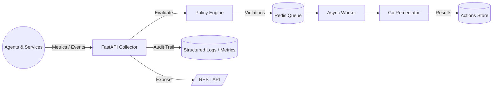
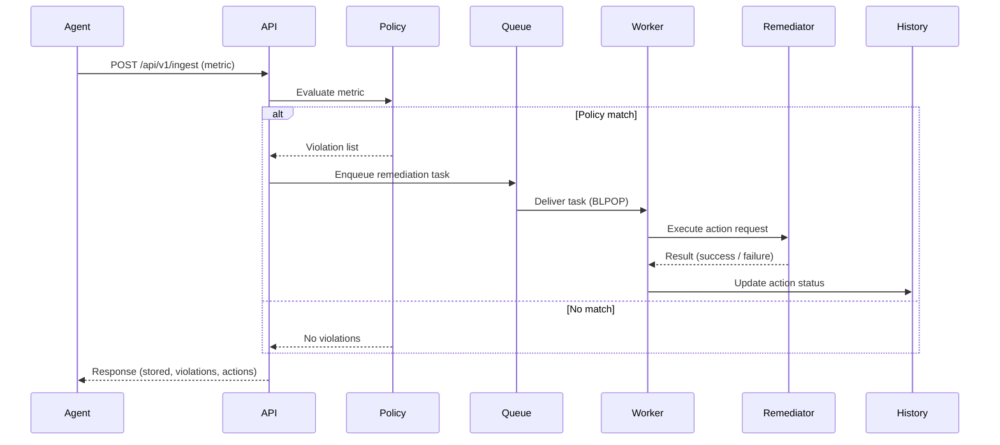
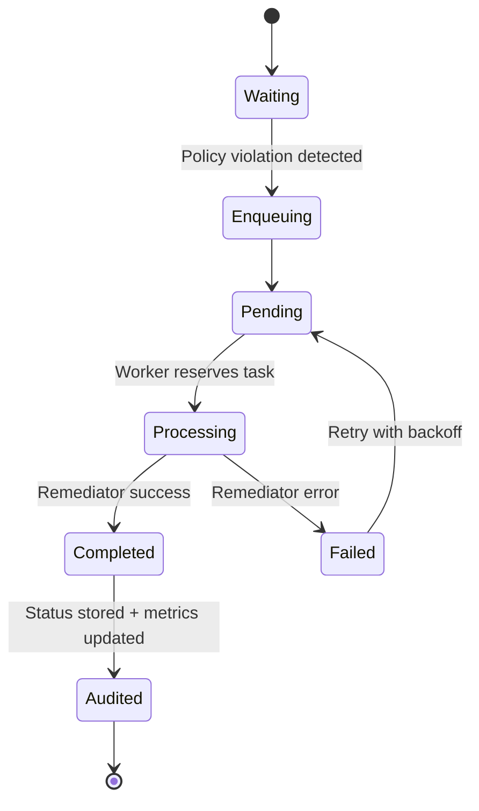

# Vigil Monitoring System

> A backend-first, self-healing control plane that keeps services healthy by watching metrics, evaluating policies, and triggering automated remediation.

---

## 📌 Project Overview

Vigil is a lightweight monitoring and automation service. It receives metrics and events, decides whether something is wrong, and if needed, kicks off remediation tasks. Operators use Vigil to keep applications stable without watching dashboards all day. The project focuses on a clear, reliable backend that any frontend or automation pipeline can integrate with.

Why Vigil matters:
- Reduces manual intervention by responding to incidents automatically.
- Creates a shared source of truth for health signals, policies, and actions.
- Fits easily into existing stacks thanks to a clean REST API and simple deployment.

---

## ✨ Core Features

| Area | What It Does |
|------|--------------|
| Metrics Ingestion | Accepts structured metrics or events from agents and services. |
| Policy Engine | Evaluates metrics against human-friendly rules to spot issues early. |
| Action Management | Tracks remediation actions with full history and status updates. |
| Queue & Worker | Uses Redis-backed queue and async workers to process tasks safely. |
| Remediator Integration | Talks to remediator services to execute real changes. |
| Simulator | Generates synthetic load to test Vigil end-to-end. |
| Audit & Logging | Captures everything for later review, including Prometheus metrics. |

---

## 🧭 Architecture at a Glance



- **FastAPI Collector** handles requests, validation, and routing.
- **Policy Engine** decides whether metrics break thresholds.
- **Redis Queue + Worker** ensure remediation happens in order and can retry.
- **Remediator** performs the actual fix (restart service, scale replicas, etc.).
- **Audit Trail** keeps record of what happened for observability.

---

## 🔄 Data Flow



- Metrics arrive through the ingest endpoint.
- Policies run immediately and also on a scheduled background runner.
- Remediation tasks join the queue and workers process them.
- Actions, statuses, and logs become available for dashboards or audits.

---

## ⚙️ Queue & Worker Lifecycle



- **Pending** tasks stay in Redis until a worker grabs them.
- **Processing** includes calling the remediator and updating the action record.
- **Failed** tasks record the error and can retry.
- **Completed** tasks feed Prometheus counters, logs, and history endpoints.

---

## 🚀 Getting Started (Backend Only)

### Prerequisites
- Python 3.12+
- Redis (local or Docker)
- Optional: PostgreSQL (SQLite works by default)

### 1. Clone the repository
```bash
git clone https://github.com/techmedaddy/vigil.git
cd vigil
```

### 2. Set up the backend
```bash
cd python/app
python -m venv .venv
source .venv/bin/activate
pip install -r ../requirements.txt
```

### 3. Configure environment (optional)
```bash
cp ../.env.example ../.env
# adjust DATABASE_URL, REDIS_URL, CORS_ORIGINS as needed
```

### 4. Start Vigil API
```bash
uvicorn app.main:app --host 127.0.0.1 --port 8000 --reload
```

### 5. Verify health
```bash
curl http://localhost:8000/health
```
Expected:
```json
{"status": "healthy", "service": "vigil"}
```

You now have the backend running. Connect any frontend (React, Vite, Google AI Studio, etc.) to `http://localhost:8000`.

---

## 🧪 Key API Endpoints

| Endpoint | Method | Description |
|----------|--------|-------------|
| `/api/v1/ingest` | POST | Store metrics/events and trigger policy evaluation. |
| `/api/v1/actions` | GET | List actions with status, pagination ready. |
| `/api/v1/actions/{id}` | GET | Retrieve action details. |
| `/api/v1/actions/status/{status}` | GET | Filter actions (pending, running, completed, failed, cancelled). |
| `/api/v1/policies` | GET | List all policies and settings. |
| `/api/v1/policies` | POST | Create new policy with condition and action. |
| `/api/v1/policies/{name}` | PUT | Update policy metadata and toggles. |
| `/api/v1/policies/{name}` | DELETE | Remove a policy. |
| `/api/v1/policies/evaluate` | POST | Test policies against sample metrics. |
| `/api/v1/policies/runner/status` | GET | Check background policy runner health. |
| `/api/v1/ui/queue/stats` | GET | (To be moved) Queue depth, processed counts, failure totals. |
| `/api/v1/ui/simulator/*` | POST/GET | (To be moved) Start/stop simulator and view status. |
| `/metrics` | GET | Prometheus metrics scrape endpoint. |
| `/health` | GET | Simple service liveness check. |

### Example: Ingest Metric
```bash
curl -X POST http://localhost:8000/api/v1/ingest \
  -H "Content-Type: application/json" \
  -d '{
        "name": "cpu_usage",
        "value": 87.5,
        "tags": {"host": "web-01", "region": "us-east-1"}
      }'
```
Response:
```json
{
  "ok": true,
  "metric_id": 12345,
  "status": "stored",
  "policies_evaluated": true,
  "violations": [
    {
      "policy_name": "high-cpu-alert",
      "severity": "warning",
      "action": "scale-up"
    }
  ]
}
```

### Example: Queue Stats
```bash
curl http://localhost:8000/api/v1/ui/queue/stats
```
Response:
```json
{
  "queue_length": 2,
  "tasks_enqueued": 158,
  "tasks_dequeued": 156,
  "tasks_failed": 3,
  "tasks_completed": 153,
  "last_processed_task": {
    "task_id": "task_1706956800",
    "action_id": 456,
    "target": "web-service-01",
    "timestamp": "2026-01-19T12:00:00Z"
  }
}
```

### Example: Policy Management
```bash
curl -X POST http://localhost:8000/api/v1/policies \
  -H "Content-Type: application/json" \
  -d '{
        "name": "high-cpu-alert",
        "description": "Scale up when CPU exceeds 90%",
        "severity": "warning",
        "target": "web-*",
        "enabled": true,
        "auto_remediate": true,
        "condition": {
          "type": "metric_exceeds",
          "metric": "cpu_percent",
          "threshold": 90
        },
        "action": "scale-up",
        "params": {"replicas": 2}
      }'
```

---

## 🧑‍💻 Usage Walkthrough

1. **Send Metrics**: Agents post CPU, memory, HTTP response times, and custom signals to `/api/v1/ingest`.
2. **Evaluate Policies**: Policies flag abnormal values (e.g., CPU > 90%) and decide whether to remediate automatically.
3. **Queue Tasks**: Violations enqueue remediation tasks into Redis.
4. **Worker Executes**: Background worker dequeues tasks and calls the remediator service.
5. **Remediator Acts**: Remediator restarts services, scales deployments, or triggers custom handlers.
6. **Review Actions**: Operators check `/api/v1/actions` to see what happened and when.
7. **Observe Metrics**: Prometheus scrapes `/metrics` for dashboards and alerting.

---

## 📊 Observability & Monitoring

| Channel | What You Get | Tools |
|---------|--------------|-------|
| Structured Logs | JSON logs for every request, policy evaluation, and task. | Log aggregation services, jq |
| Prometheus Metrics | Custom counters and gauges for ingest, queue depth, policy violations, and worker state. | Prometheus, Grafana |
| Queue Stats Endpoint | Live queue health, successes, failures, last task info. | Custom dashboards, frontend integration |
| Action History | Detailed status for each remediation, including timestamps and outcome. | REST clients, automation |

Suggested setup:
- Scrape `/metrics` with Prometheus.
- Forward logs into ELK / Loki / any preferred stack.
- Build dashboards in Grafana or Google AI Studio using the REST API.

---

## 🎬 Demo Story: "Scale Up the Web Tier"

1. Web service load increases, CPU hits 92%.
2. Agent posts `cpu_usage=92` to Vigil.
3. Policy `high-cpu-alert` detects threshold breach and enqueues `scale-up` action.
4. Worker picks task and asks Remediator to scale the deployment to 4 replicas.
5. Remediator succeeds and reports back.
6. Actions API shows `status=completed` with timestamps and notes.
7. Prometheus metric `vigil_policy_violations_total{policy_name="high-cpu-alert"}` increments.
8. Operator sees the successful action and lower CPU usage on their dashboard minutes later.

---

## 🛣️ Future Roadmap

| Area | Planned Enhancements |
|------|----------------------|
| Remediation Plugins | Pluggable actions for Kubernetes, cloud APIs, serverless, and custom scripts. |
| External Hooks | Webhooks and message bus integrations for Slack, PagerDuty, Kafka, and event-driven workflows. |
| Scaling | Horizontal sharding of queue workers, multi-region Redis support, and policy evaluation batching. |
| Security | Authentication, RBAC roles, signed policy bundles, and TLS-by-default deployments. |
| Analytics | Richer reporting with anomaly detection, historical policy impact, and trend analysis. |

---

## �� Credits

- **Core Engineering**: @techmedaddy

