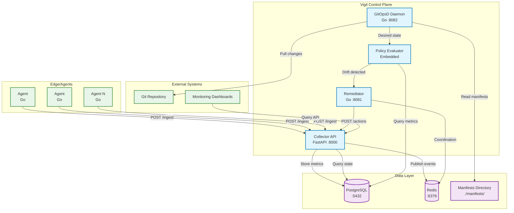

# Vigil Architecture

Vigil is a lightweight, GitOps-style drift detection and self-healing engine designed for production environments where simplicity, reliability, and composability are paramount. This document provides a comprehensive technical overview of the system architecture, components, and operational patterns.

## Overview

Vigil implements a control loop pattern where distributed agents collect telemetry, a centralized collector ingests and evaluates metrics against desired state manifests, and a remediator executes corrective actions when drift is detected. The system is designed to operate without Kubernetes dependencies while maintaining GitOps principles through manifest-driven configuration.

## High-Level Architecture



## Service Components

### Collector API (FastAPI)

The Collector API serves as the central ingestion and coordination hub for the Vigil system.

**Responsibilities:**
- Ingest telemetry data from distributed agents
- Store metrics and audit logs in PostgreSQL
- Trigger policy evaluation workflows
- Coordinate with remediator for action execution
- Provide query interfaces for dashboards and tooling

**Key Endpoints:**
- `POST /ingest` - Receive metrics from agents
- `GET /query` - Query historical metrics
- `POST /actions` - Receive audit logs from remediator
- `GET /health` - Health check endpoint
- `GET /drift` - Current drift detection status

**Technology Stack:**
- FastAPI for high-performance async HTTP handling
- SQLAlchemy for database ORM
- Redis client for pub/sub messaging
- Pydantic for request/response validation

### Agent (Go)

Lightweight telemetry collection daemons deployed on monitored infrastructure.

**Responsibilities:**
- Collect system metrics (CPU, memory, disk, network)
- Monitor service health and availability
- Report application-specific metrics
- Maintain minimal resource footprint

**Configuration:**
- Collector endpoint URL and credentials
- Metric collection intervals
- Local caching and retry policies
- TLS/authentication settings

**Deployment Pattern:**
- Single binary with minimal dependencies
- Configurable via YAML file or environment variables
- Supports both push and pull metric collection modes

### GitOpsD Daemon (Go)

The GitOps daemon manages desired state synchronization and manifest processing.

**Responsibilities:**
- Monitor Git repository for manifest changes
- Parse and validate YAML/JSON manifest files
- Maintain desired state cache in Redis
- Trigger drift detection workflows
- Handle Git authentication and webhook integration

**Manifest Structure:**
```yaml
apiVersion: vigil.io/v1
kind: Service
metadata:
  name: web-service
  namespace: production
spec:
  replicas: 3
  resources:
    cpu: "500m"
    memory: "1Gi"
  healthCheck:
    endpoint: "/health"
    interval: 30s
  remediation:
    restartThreshold: 3
    cooldownPeriod: "5m"
```

### Remediator (Go)

Executes remediation actions based on policy decisions and drift detection results.

**Responsibilities:**
- Receive remediation requests from evaluator
- Execute corrective actions (restart, scale, notify)
- Implement circuit breaker patterns
- Report action results and audit trails
- Coordinate with external systems (orchestrators, cloud APIs)

**Action Types:**
- Service restart/reload
- Infrastructure scaling
- Configuration updates
- Alert/notification dispatch
- Custom script execution

**Safety Mechanisms:**
- Rate limiting and cooldown periods
- Dry-run mode for validation
- Action approval workflows
- Rollback capabilities

## Control Loop Architecture

The Vigil control loop implements a continuous evaluation and remediation cycle:

```
┌─────────────┐    ┌──────────────┐    ┌─────────────────┐    ┌─────────────┐
│   Ingest    │───▶│   Evaluate   │───▶│ Drift Detection │───▶│ Remediation │
└─────────────┘    └──────────────┘    └─────────────────┘    └─────────────┘
      ▲                     │                     │                     │
      │                     ▼                     ▼                     │
┌─────────────┐    ┌──────────────┐    ┌─────────────────┐              │
│   Agents    │    │ Policy Rules │    │   Manifests     │              │
└─────────────┘    └──────────────┘    └─────────────────┘              │
      ▲                                                                  │
      │                                                                  │
      └──────────────────────────────────────────────────────────────────┘
```

### 1. Ingest Phase
- Agents collect and transmit metrics to Collector
- Collector validates, enriches, and stores telemetry
- Events published to Redis for async processing

### 2. Evaluate Phase
- Policy evaluator processes incoming metrics
- Historical trend analysis and threshold checking
- Correlation with infrastructure topology

### 3. Drift Detection Phase
- Compare observed state with desired manifests
- Calculate drift severity and impact assessment
- Generate remediation recommendations

### 4. Remediation Phase
- Execute approved remediation actions
- Monitor action progress and outcomes
- Update audit trails and notification systems

## Data Flow Architecture

### Metrics Flow

```
Agent → [HTTP POST] → Collector → PostgreSQL (persistent storage)
                              → Redis (event stream)
                              → Policy Evaluator → Drift Analysis
```

### Desired State Flow

```
Git Repository → GitOpsD → Manifest Parser → Redis (desired state cache)
                                         → Policy Evaluator → Drift Analysis
```

### Action Flow

```
Drift Detection → Remediator → External Systems (restart, scale, etc.)
                           → Collector (/actions) → PostgreSQL (audit log)
```

## Drift Detection Mechanism

### Manifest Processing

GitOpsD continuously monitors the `manifests/` directory or configured Git repository:

1. **File Watching**: inotify/polling for local changes, webhooks for Git
2. **Parsing**: YAML/JSON validation and normalization
3. **Caching**: Store parsed manifests in Redis for fast access
4. **Versioning**: Track manifest versions and change history

### Drift Calculation

The policy evaluator performs drift analysis by:

1. **State Comparison**: Compare current metrics with desired thresholds
2. **Trend Analysis**: Evaluate metric trends over configurable time windows  
3. **Policy Application**: Apply custom rules and threshold logic
4. **Severity Scoring**: Calculate drift severity (info, warning, critical)

### Example Drift Rules

```yaml
policies:
  - name: high-cpu-usage
    condition: cpu_usage > 80% for 5m
    severity: warning
    action: scale_up
    
  - name: service-down
    condition: health_check_failed for 3 attempts
    severity: critical
    action: restart_service
    
  - name: memory-leak
    condition: memory_usage increasing for 30m
    severity: warning
    action: restart_service
```

## Database Schema

### PostgreSQL Tables

```sql
-- Metrics storage
CREATE TABLE metrics (
    id BIGSERIAL PRIMARY KEY,
    name VARCHAR(255) NOT NULL,
    value DOUBLE PRECISION NOT NULL,
    labels JSONB,
    timestamp TIMESTAMPTZ DEFAULT NOW(),
    source VARCHAR(255)
);

-- Action audit log
CREATE TABLE actions (
    id UUID PRIMARY KEY DEFAULT gen_random_uuid(),
    correlation_id UUID,
    target VARCHAR(255) NOT NULL,
    action VARCHAR(100) NOT NULL,
    status VARCHAR(50) NOT NULL,
    details JSONB,
    started_at TIMESTAMPTZ DEFAULT NOW(),
    completed_at TIMESTAMPTZ
);

-- Desired state manifests
CREATE TABLE manifests (
    id UUID PRIMARY KEY DEFAULT gen_random_uuid(),
    name VARCHAR(255) NOT NULL,
    namespace VARCHAR(255),
    content JSONB NOT NULL,
    version VARCHAR(100),
    checksum VARCHAR(64),
    created_at TIMESTAMPTZ DEFAULT NOW()
);

-- Drift detection results
CREATE TABLE drift_events (
    id UUID PRIMARY KEY DEFAULT gen_random_uuid(),
    resource_name VARCHAR(255) NOT NULL,
    drift_type VARCHAR(100) NOT NULL,
    severity VARCHAR(50) NOT NULL,
    current_state JSONB,
    desired_state JSONB,
    detected_at TIMESTAMPTZ DEFAULT NOW()
);
```

### Redis Usage Patterns

**Pub/Sub Channels:**
- `metrics:ingested` - New metric ingestion notifications
- `drift:detected` - Drift detection events
- `actions:requested` - Remediation action requests

**Data Structures:**
- `desired_state:{resource}` - Cached manifest data (Hash)
- `action_locks:{target}` - Remediation coordination (String with TTL)
- `evaluation_queue` - Pending evaluation tasks (List)

## Network Topology

### Port Allocation

| Service    | Port | Protocol | Purpose                    |
|------------|------|----------|----------------------------|
| Collector  | 8000 | HTTP     | API endpoints              |
| Remediator | 8081 | HTTP     | Remediation actions        |
| GitOpsD    | 8082 | HTTP     | Status and webhooks        |
| PostgreSQL | 5432 | TCP      | Database connections       |
| Redis      | 6379 | TCP      | Cache and messaging        |

### Inter-Service Communication

**Agent → Collector:**
- Protocol: HTTPS (TLS recommended)
- Authentication: API key or mTLS
- Retry: Exponential backoff with jitter
- Batching: Optional metric bundling

**Collector → PostgreSQL:**
- Connection pooling (pgbouncer recommended)
- Read replicas for query workloads
- Connection limits and timeouts

**Collector ↔ Redis:**
- Connection pooling for pub/sub
- Sentinel for high availability
- Cluster mode for scaling

**Collector → Remediator:**
- HTTP POST for action requests
- Correlation IDs for tracking
- Timeout and circuit breaker patterns

### Security Considerations

- **Network Segmentation**: Deploy services in isolated network segments
- **TLS Encryption**: All HTTP traffic should use TLS in production
- **Authentication**: API keys, JWT tokens, or mTLS for service-to-service
- **Authorization**: RBAC for dashboard and API access
- **Secrets Management**: External secret store integration

## Dashboard and API Design

### Collector API Endpoints

```
GET  /health                    # Service health check
POST /ingest                    # Metric ingestion
GET  /query                     # Metric queries
POST /actions                   # Action audit logging
GET  /actions                   # Action history
GET  /drift                     # Current drift status
GET  /manifests                 # Manifest listing
POST /evaluate/{resource}       # Manual evaluation trigger
```

### Dashboard Features

**Metrics Visualization:**
- Real-time metric dashboards
- Historical trend analysis  
- Alert threshold visualization
- Service topology mapping

**Drift Monitoring:**
- Active drift detection status
- Drift history and patterns
- Remediation action outcomes
- Resource health scorecards

**Audit and Compliance:**
- Action audit trails
- Change tracking and approval
- Compliance reporting
- Performance metrics

## Deployment Architecture

### Single-Node Docker Compose

```yaml
version: '3.8'

services:
  postgres:
    image: postgres:15-alpine
    environment:
      POSTGRES_DB: vigil
      POSTGRES_USER: vigil
      POSTGRES_PASSWORD_FILE: /run/secrets/postgres_password
    volumes:
      - postgres_data:/var/lib/postgresql/data
      - ./sql/init.sql:/docker-entrypoint-initdb.d/init.sql
    secrets:
      - postgres_password
    networks:
      - vigil-network

  redis:
    image: redis:7-alpine
    command: redis-server --requirepass vigil_redis_pass
    volumes:
      - redis_data:/data
    networks:
      - vigil-network

  collector:
    build:
      context: ./python
      dockerfile: Dockerfile
    environment:
      DATABASE_URL: postgresql://vigil@postgres:5432/vigil
      REDIS_URL: redis://:vigil_redis_pass@redis:6379/0
      LOG_LEVEL: INFO
    ports:
      - "8000:8000"
    depends_on:
      - postgres
      - redis
    networks:
      - vigil-network
    restart: unless-stopped

  gitopsd:
    build:
      context: ./go/gitopsd
      dockerfile: Dockerfile
    environment:
      COLLECTOR_URL: http://collector:8000
      REDIS_URL: redis://:vigil_redis_pass@redis:6379/0
      MANIFEST_PATH: /manifests
      GIT_REPO_URL: https://github.com/your-org/vigil-manifests.git
    volumes:
      - ./manifests:/manifests:ro
      - gitops_cache:/cache
    ports:
      - "8082:8082"
    depends_on:
      - collector
      - redis
    networks:
      - vigil-network
    restart: unless-stopped

  remediator:
    build:
      context: ./go/remediator
      dockerfile: Dockerfile
    environment:
      COLLECTOR_URL: http://collector:8000
      REDIS_URL: redis://:vigil_redis_pass@redis:6379/0
      LOG_LEVEL: INFO
    ports:
      - "8081:8081"
    depends_on:
      - collector
      - redis
    networks:
      - vigil-network
    restart: unless-stopped
    # Mount docker socket for container operations
    volumes:
      - /var/run/docker.sock:/var/run/docker.sock

networks:
  vigil-network:
    driver: bridge

volumes:
  postgres_data:
  redis_data:
  gitops_cache:

secrets:
  postgres_password:
    file: ./secrets/postgres_password.txt
```

### Production Deployment Considerations

**High Availability:**
- Multi-region deployment with data replication
- Load balancers for Collector API endpoints
- Redis Sentinel or Cluster for cache layer
- PostgreSQL streaming replication

**Scaling Patterns:**
- Horizontal scaling of Collector instances
- Dedicated evaluator workers for heavy workloads
- Read replicas for dashboard queries
- Agent connection pooling and load distribution

**Monitoring and Observability:**
- Prometheus metrics export
- Structured logging with ELK/Loki
- Distributed tracing with Jaeger/Zipkin
- Custom dashboards in Grafana

## Design Principles

### Simplicity First

- **Clear Separation of Concerns**: Each service has a single, well-defined responsibility
- **Minimal Dependencies**: Avoid complex frameworks and heavy dependencies
- **Explicit Configuration**: All behavior configurable via files or environment variables
- **Fail Fast**: Early validation and clear error messages

### Small Footprint

- **Resource Efficiency**: Optimize for low CPU and memory usage
- **Binary Distribution**: Single binary deployment for Go services
- **Minimal Runtime**: No JVM or heavy runtime requirements
- **Edge Compatibility**: Can run on resource-constrained environments

### Composability

- **API-First Design**: All functionality exposed via REST APIs
- **Pluggable Architecture**: Easy to replace or extend individual components
- **Standard Interfaces**: Use common protocols (HTTP, SQL, Redis)
- **Language Agnostic**: Services can be implemented in different languages

### GitOps-Lite Principles

- **Declarative Configuration**: Infrastructure described in version-controlled manifests
- **Git as Source of Truth**: All changes tracked through Git workflows
- **Automated Reconciliation**: Continuous drift detection and remediation
- **Audit Trail**: Complete history of changes and actions

### No Kubernetes Dependency

- **Standalone Operation**: Can run on VMs, bare metal, or container platforms
- **Cloud Agnostic**: Works across different cloud providers and on-premises
- **Simple Orchestration**: Docker Compose or systemd for service management
- **Kubernetes Compatible**: Can integrate with K8s without requiring it

### Operational Excellence

- **Observability Built-In**: Comprehensive logging, metrics, and tracing
- **Graceful Degradation**: Continue operating with reduced functionality
- **Circuit Breaker Patterns**: Prevent cascade failures
- **Configuration Validation**: Validate configs before applying changes
- **Rollback Capabilities**: Easy rollback of failed changes

## Security Architecture

### Authentication and Authorization

**Service-to-Service:**
- mTLS for internal communication
- JWT tokens with short TTL
- API key rotation policies

**External Access:**
- OIDC integration for dashboard access
- RBAC for different user roles
- API rate limiting and abuse prevention

### Data Protection

**Encryption:**
- TLS 1.3 for data in transit
- Database encryption at rest
- Secret management with external stores (Vault, AWS Secrets Manager)

**Access Control:**
- Network segmentation and firewall rules
- VPN requirements for administrative access
- Audit logging for all access attempts

## Performance and Scaling

### Throughput Characteristics

- **Collector**: 10,000+ metrics/second per instance
- **Agent**: Sub-second metric collection intervals
- **Database**: Optimized for time-series workloads
- **Remediation**: Sub-minute response times

### Scaling Strategies

**Vertical Scaling:**
- Increase CPU/memory for individual services
- SSD storage for database performance
- Connection pool tuning

**Horizontal Scaling:**
- Load balance Collector instances
- Shard agents across multiple Collectors
- Read replicas for query workloads
- Cache layer optimization

### Performance Monitoring

- Response time percentiles (p50, p95, p99)
- Throughput metrics per service
- Resource utilization tracking  
- Error rate and success rate monitoring

## Disaster Recovery

### Backup Strategy

**Database Backups:**
- Daily full backups with point-in-time recovery
- Cross-region backup replication
- Automated backup testing and validation

**Configuration Backups:**
- Git repository mirroring
- Configuration snapshots
- Infrastructure as code versioning

### Recovery Procedures

**Service Recovery:**
- Automated service restart and health checking
- Blue-green deployment for updates
- Rollback procedures for failed deployments

**Data Recovery:**
- Point-in-time database recovery
- Manifest restoration from Git history
- Action replay from audit logs

This architecture provides a solid foundation for building and operating Vigil in production environments while maintaining the flexibility to adapt to changing requirements and scale with organizational growth.
