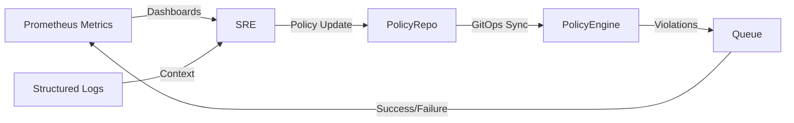
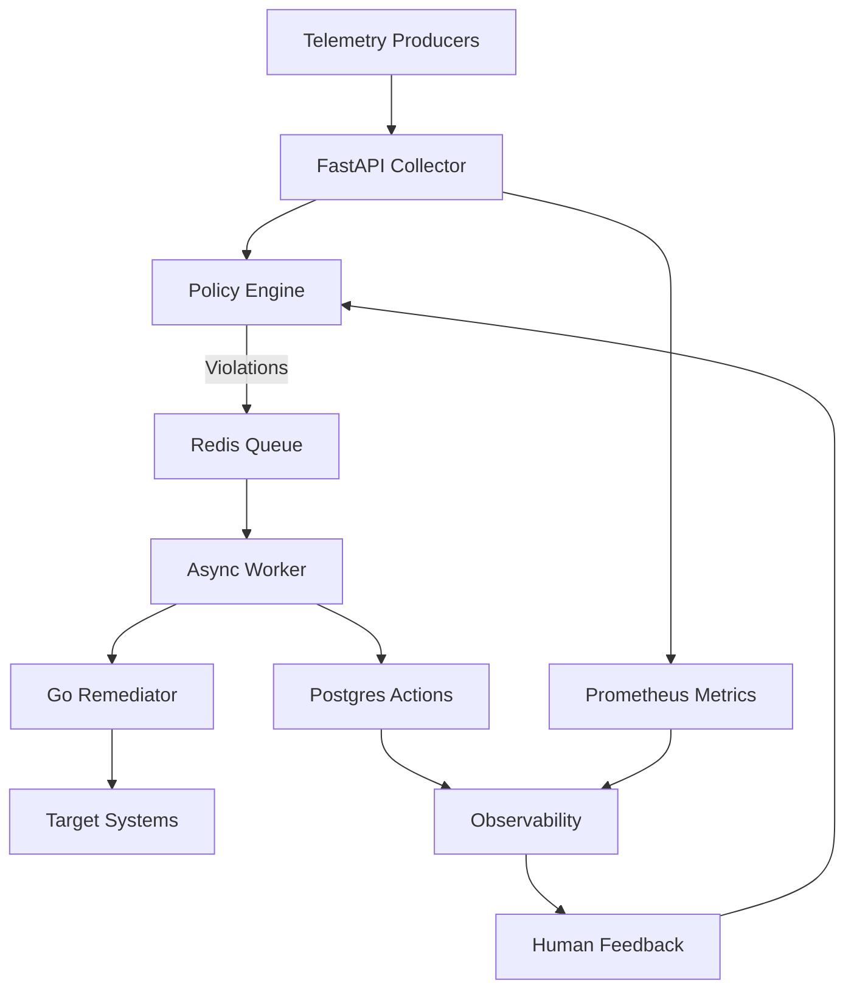

# Vigil Monitoring System — Theoretical Guide

> **Audience:** Architects, SREs, interview prep
>
> **Focus:** Conceptual understanding, control-plane theory, diagrams
>
> **Last Updated:** January 22, 2026

---

## Table of Contents

1. [Conceptual Foundations](#1-conceptual-foundations)
2. [System Context & Actors](#2-system-context--actors)
3. [Control Loop Anatomy](#3-control-loop-anatomy)
4. [Architecture Principles](#4-architecture-principles)
5. [Component Narratives](#5-component-narratives)
6. [Data & Event Lifecycle](#6-data--event-lifecycle)
7. [Policy Intelligence Model](#7-policy-intelligence-model)
8. [Remediation Pipeline Theory](#8-remediation-pipeline-theory)
9. [Observability & Feedback](#9-observability--feedback)
10. [Resilience & Scalability Strategies](#10-resilience--scalability-strategies)
11. [Security & Governance Lens](#11-security--governance-lens)
12. [Evolution Pathways](#12-evolution-pathways)

---

## 1. Conceptual Foundations

Vigil is a **closed-loop control plane**. Its purpose is to perceive system health signals, decide when those signals violate intent, and act to restore desired state. The design is driven by three questions:

1. **What is reality?** → stream of metrics, events, and drifts.
2. **What should reality be?** → human-authored policies capturing SLOs and remediation playbooks.
3. **How do we converge reality to intent?** → deterministic queue + workers executing actions.

Key mental model: _"Automated Site Reliability Engineer"_. Vigil codifies the heuristics SREs use into programmable policies, enabling continuous remediation without fatigue.

---

## 2. System Context & Actors

```
┌──────────────────────────────────────────────────────────────────────┐
│                         EXTERNAL ENVIRONMENT                         │
├──────────────────────────────────────────────────────────────────────┤
│                                                                      │
│  ┌────────────┐     ┌───────────────┐     ┌────────────┐            │
│  │  Services  │────▶│ Vigil Agents  │────▶│ Vigil API  │            │
│  │  & Hosts   │     │  (Go, Python) │     │  Collector │            │
│  └────────────┘     └───────────────┘     └──────┬─────┘            │
│                                                   │                │
│                                                   ▼                │
│                                          ┌────────────────┐        │
│                                          │ Policy Authors │◀───────┤
│                                          └────────────────┘        │
│                                                                      │
└──────────────────────────────────────────────────────────────────────┘
```

**Primary actors:**

- **Service Instances:** produce metrics and experience incidents.
- **Vigil Agents:** instruments running close to workloads capturing telemetry.
- **Policy Authors (Humans):** encode business intent via policy DSL.
- **Vigil Control Plane:** senses, decides, acts within infrastructure boundaries.

---

## 3. Control Loop Anatomy

Vigil follows an **observe → orient → decide → act** loop. Each iteration is triggered by either an incoming metric or a scheduled evaluation.

```
┌────────────┐   Sense    ┌────────────┐   Contextualize   ┌────────────┐   Decide   ┌────────────┐   Act   ┌────────────┐
│ Telemetry  │──────────▶│ Ingestion  │──────────────────▶│ Policy      │──────────▶│ Queue       │──────▶│ Worker +   │
│ Producers  │           │ Gateway    │                   │ Evaluator   │           │ Orchestrator│        │ Remediator │
└────────────┘           └────────────┘                   └────────────┘           └────────────┘        └────────────┘
```

- **Sense:** Agents push metrics/events.
- **Orient:** FastAPI normalizes payloads, enriches with tags, persists raw telemetry.
- **Decide:** Policy engine matches conditions, yielding violations.
- **Act:** Violations spawn remediation intents queued for execution.
- **Learn:** Outcomes fed back via metrics for continuous calibration.

The loop is intentionally asynchronous to absorb bursts and prevent cascading failures.

---

## 4. Architecture Principles

1. **Separation of Concerns:** ingest, evaluate, and act are discrete modules connected through contracts (HTTP, Redis, Postgres).
2. **Deterministic Remediation:** all actions flow through a serialized queue to preserve ordering and allow replay.
3. **Policy-as-Code:** policies are structured data (YAML/JSON) that can be versioned, reviewed, and tested.
4. **Observable by Default:** every state transition emits logs and Prometheus metrics.
5. **Graceful Degradation:** if policies or remediator are unavailable, ingestion continues and violations accumulate without data loss.
6. **Human Override:** manual actions use the same pipeline, ensuring consistent audit trails.

---

## 5. Component Narratives

### 5.1 FastAPI Collector

- Thin HTTP façade.
- Handles validation, tenant tagging, and execution of background tasks.
- Implements idempotent endpoints to tolerate agent retries.

### 5.2 Policy Engine

- Lives in-process for low-latency evaluation.
- Conditions compile into callables; actions mapped to async coroutines.
- Supports dynamic reloading for GitOps workflows.

### 5.3 Redis Queue

- Single source of truth for pending remediation intents.
- List semantics (RPUSH/BLPOP) guarantee FIFO order.
- Metadata stored alongside tasks for metrics and replay.

### 5.4 Remediation Worker

- Async worker consumes queue with cooperative multitasking.
- Implements exponential backoff and circuit breakers when contacting remediator.
- Updates action state in Postgres, emitting telemetry.

### 5.5 Go Remediator

- Executes infrastructure actions (restart container, patch deployment, scale set).
- Designed as stateless command router; delegates to orchestrators (Kubernetes API, systemd, cloud SDKs).

---

## 6. Data & Event Lifecycle

```
1. Metric Event
   └─ Agent → API (HTTP POST /ingest)
      └─ Stored in Postgres (metrics table)
      └─ Metric counter incremented (Prometheus)
      └─ Policy evaluation triggered
          └─ Violations detected?
             ├─ No → Exit
             └─ Yes
                └─ Action intent created (actions table)
                └─ Task enqueued (Redis)
                └─ Queue metrics updated
                └─ Worker dequeues intent
                    └─ Remediator executes
                    └─ Outcome persisted + emitted
```

The lifecycle is **append-only**—data is never overwritten, enabling post-incident forensics.

---

## 7. Policy Intelligence Model

### 7.1 Policy Grammar

Policies are structured as nested logical operators and evaluators:

```
Policy := {
  name: string,
  target: pattern,
  condition: Condition,
  action: Action,
  severity: enum,
  auto_remediate: bool,
  params: map
}

Condition :=
  | metric_exceeds(metric, threshold)
  | metric_below(metric, threshold)
  | all(Condition...)
  | any(Condition...)
  | custom(fn)
```

### 7.2 Decision Matrix

| Input Metrics | Condition Satisfied? | Auto Remediate? | Outcome |
|---------------|----------------------|------------------|---------|
| Yes | No | N/A | Policy ignored |
| Yes | Yes | False | Alert (no action), record violation |
| Yes | Yes | True | Alert + queue remediation |

### 7.3 Trust Boundaries

- **Policy Content** is authored and reviewed by humans (GitOps).
- **Evaluation** is deterministic; no probabilistic ML to ensure explainability.
- **Remediation** respects idempotency and supports dry-run/test modes.

---

## 8. Remediation Pipeline Theory

```
┌───────────┐   intent   ┌──────────────┐   dispatch   ┌──────────────┐   effect   ┌──────────────┐
│ Violation │──────────▶│ Action Model │────────────▶│ Worker Engine │──────────▶│ Infrastructure│
└───────────┘           └──────────────┘             └──────────────┘            └──────────────┘
                               │                              │                           │
                               ▼                              ▼                           ▼
                        Postgres persistence         Observability events         System state change
```

### Safety Mechanisms

1. **Queue Backpressure:** if remediator is slow, tasks accumulate visibly; ingestion unaffected.
2. **Retries with Jitter:** exponential backoff prevents synchronized retries.
3. **Dead Letter Strategy (planned):** repeated failures will be parked for manual review.
4. **Stateful Idempotency:** actions carry unique IDs to avoid duplicate operations.

### Failure Modes

| Failure | Detection | Mitigation |
|---------|-----------|------------|
| Remediator unreachable | Worker timeouts, metrics spikes | Circuit breaker, alert policy author |
| Policy misconfiguration | Evaluation errors logged | Policy validation + dry-run |
| Queue overload | `queue_length` gauge | Horizontal scale workers, throttle simulator |

---

## 9. Observability & Feedback

### Telemetry Pillars

- **Metrics:** Prometheus gauges/counters/histograms for queue depth, request rate, action outcomes.
- **Logs:** Structured JSON with correlation IDs (metric ID, action ID, task ID).
- **Events:** Planned integration with webhooks or event buses for downstream automation.

### Feedback Loop Diagram



---

## 10. Resilience & Scalability Strategies

### Horizontal Scaling

- **API:** stateless; scale via additional pods behind load balancer.
- **Workers:** multiple consumers can BLPOP from Redis safely.
- **Remediator:** run fleet with leader election to prevent double actions.

### Vertical Scaling

- Increase Redis memory for high queue throughput.
- Tune Postgres connection pool for ingestion spikes.

### High Availability Considerations

| Layer | HA Strategy |
|-------|-------------|
| Redis | Primary/Replica with sentinel or managed service |
| Postgres | Managed service or Patroni cluster |
| API | Multiple replicas across zones |
| Remediator | Active-active with external lock |

### Disaster Recovery

- Backup policies and actions DB daily.
- Snapshot Redis or rely on durable queue alternative (Kafka) for enterprise deployments.

---

## 11. Security & Governance Lens

- **Transport Security:** recommend TLS termination at ingress; mutual TLS between agents and API for zero-trust environments.
- **Authentication & Authorization:** roadmap includes JWT-based policy authoring and signed agent tokens.
- **Auditability:** every action mutation stored with timestamps enabling compliance audits.
- **Least Privilege:** remediator runs with scoped credentials (K8s RBAC service accounts, IAM roles).

---

## 12. Evolution Pathways

| Horizon | Focus | Description |
|---------|-------|-------------|
| Short-term | Operational maturity | Queue stats API, simulator control plane, dead-letter queues |
| Mid-term | Multi-tenancy | Namespace isolation, per-tenant policies, RBAC |
| Mid-term | Adaptive policies | Integrate anomaly detection feeding into policies as dynamic thresholds |
| Long-term | Federated control | Cross-cluster coordination, edge deployments, hierarchical policies |
| Long-term | Extensibility | Plugin system for custom actions, streaming ingestion (Kafka) |

---

### Recap Diagram



---

*This theory guide emphasizes conceptual understanding for architectural discussions and interviews. Refer to `VIGIL-COMPLETE-DOCUMENTATION.md` for hands-on API details and runbooks.*
